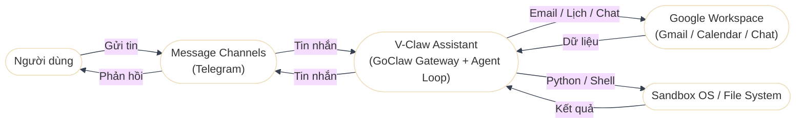
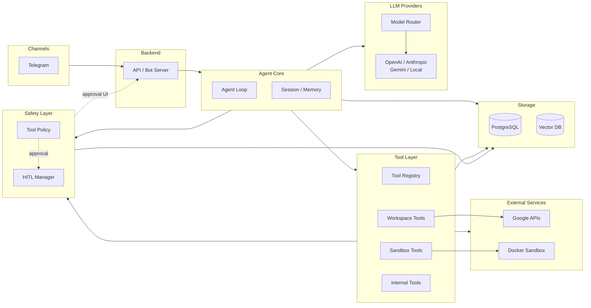

## I. Context Diagram

- Hệ thống trung tâm là V‑Claw Assistant, chịu trách nhiệm điều phối agent loop và tool call.
- Người dùng tương tác qua Message Channels; không giao tiếp trực tiếp với V‑Claw.
- V‑Claw tích hợp Google Workspace và Sandbox để xử lý tác vụ.
- Các mũi tên thể hiện luồng yêu cầu/kết quả giữa các thành phần.

## II. System Architecture

Phần này mô tả các khối chính của hệ thống và quan hệ phụ thuộc tĩnh giữa
chúng. Luồng xử lý runtime chi tiết được tách sang `04-sequences.md` để tránh
trộn component diagram với sequence/processing flow.

### 2.1 Component Responsibilities

| Khối | Trách nhiệm |
|---|---|
| Channels | Nhận/gửi tin qua Telegram hoặc chat app tương đương. |
| Backend | Chuẩn hóa request từ channel, gọi Agent Core, trả response về channel. |
| Agent Core | Điều phối agent loop, session/memory, model calls và tool calls. |
| Tool Layer | Đăng ký tool, validate schema, gọi Workspace/Sandbox/Internal tools. |
| Safety Layer | Phân loại risk, quyết định allow/block/approval, quản lý HITL. |
| LLM Providers | Định tuyến model và gọi OpenAI/Anthropic/Gemini/Local provider. |
| External Services | Google APIs và Docker sandbox mà tool layer gọi ra ngoài. |
| Storage | PostgreSQL cho runtime/audit/session; Vector DB cho retrieval/memory khi cần. |

### 2.2 Runtime Flow Reference

Các bước xử lý request, tool call, approval và trả kết quả được mô tả ở
`04-sequences.md`. Contract chi tiết nằm ở `03-contracts.md`.

## III. Usecase Diagram

[Xem Usecase Diagram](02-usecase-diagram.md)
