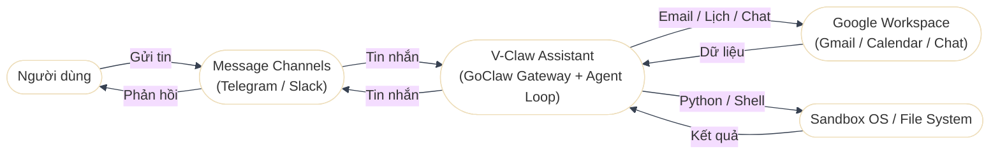
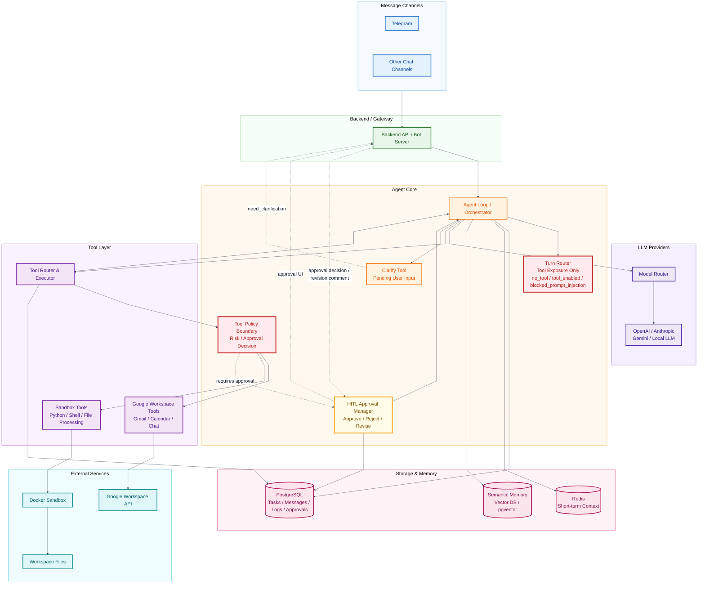

## I. Context Diagram

- Hệ thống trung tâm là V‑Claw Assistant, chịu trách nhiệm điều phối agent loop và tool call.
- Người dùng tương tác qua Message Channels; không giao tiếp trực tiếp với V‑Claw.
- V‑Claw tích hợp Google Workspace và Sandbox để xử lý tác vụ.
- Các mũi tên thể hiện luồng yêu cầu/kết quả giữa các thành phần.

## II. System architecture

## III. Usecase Diagram

[Xem Usecase Diagram](02-usecase-diagram.md)
