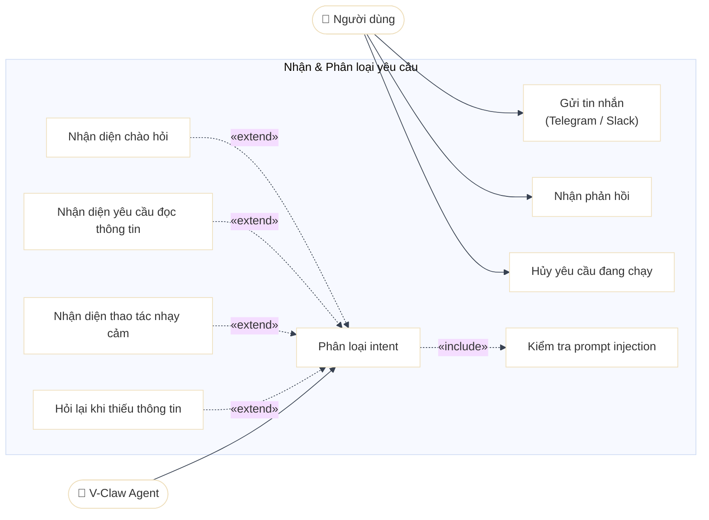
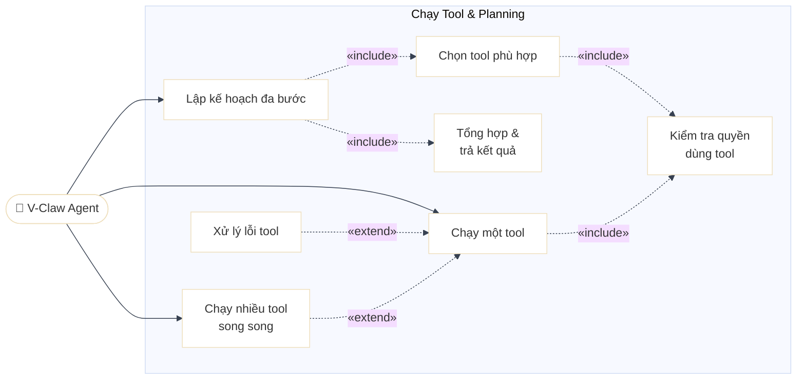
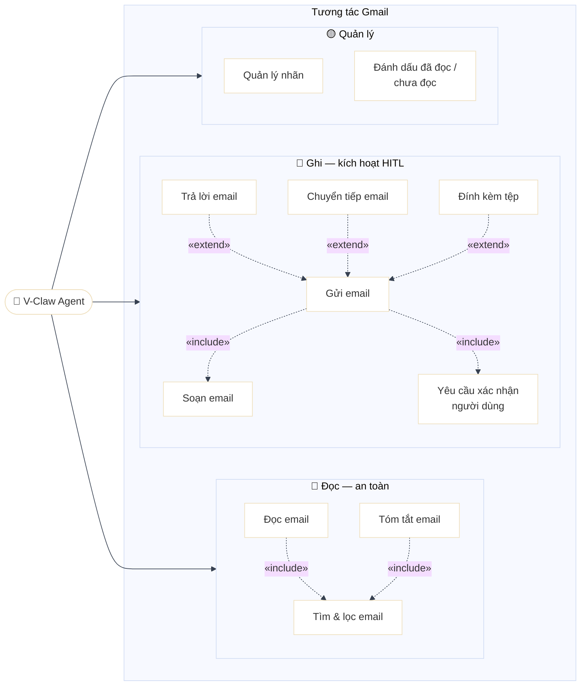
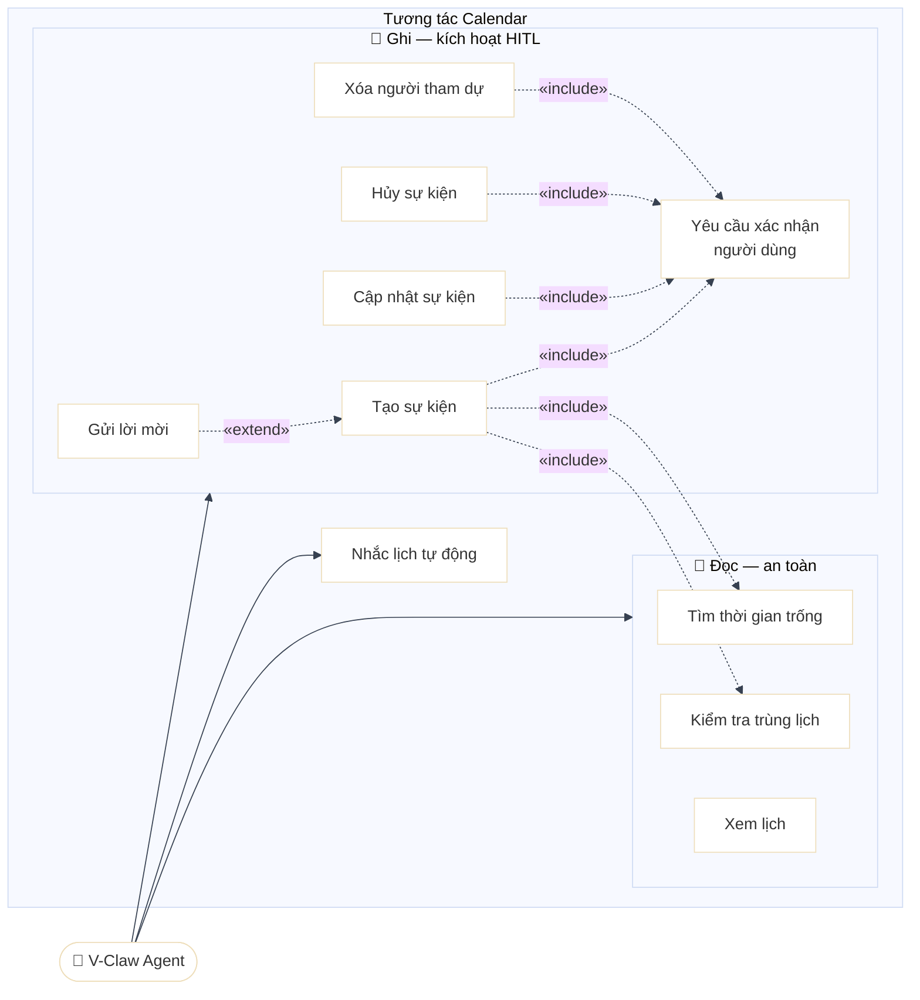
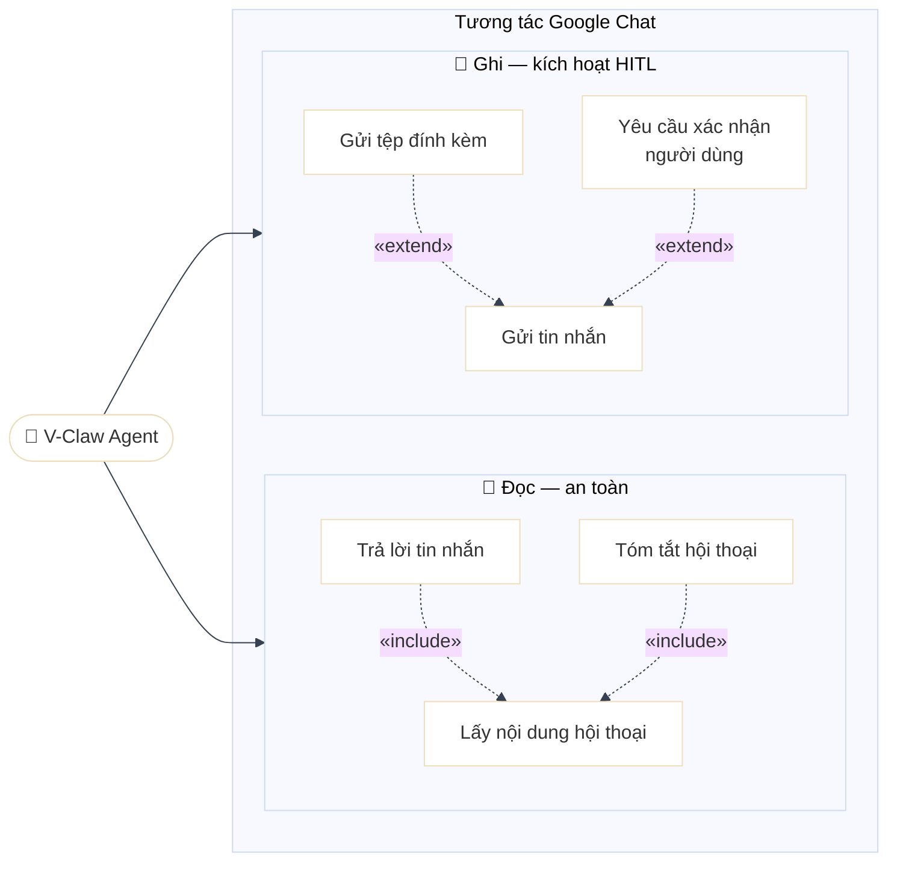
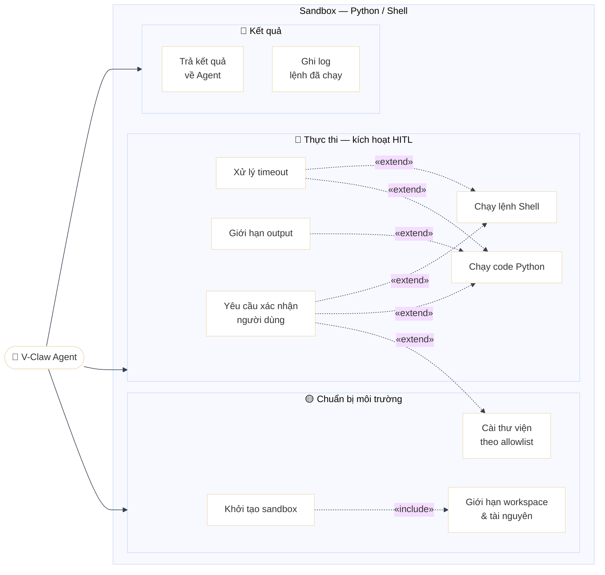
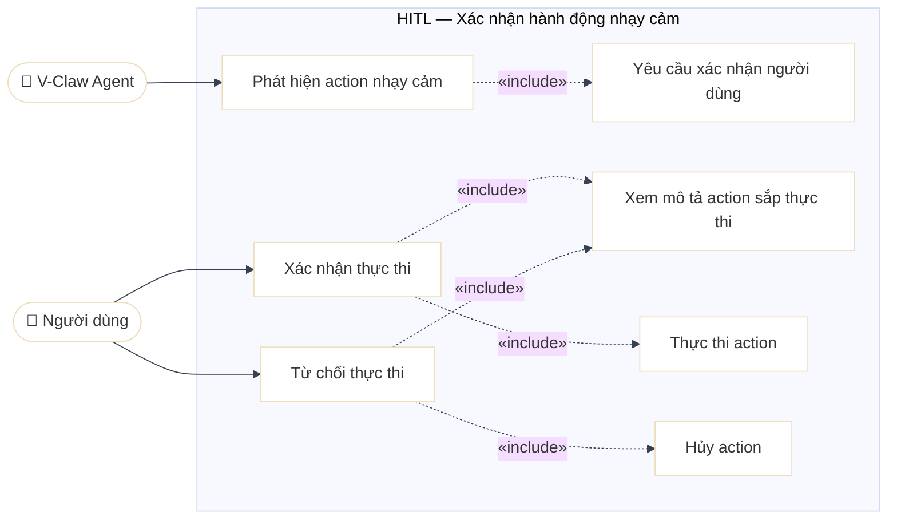
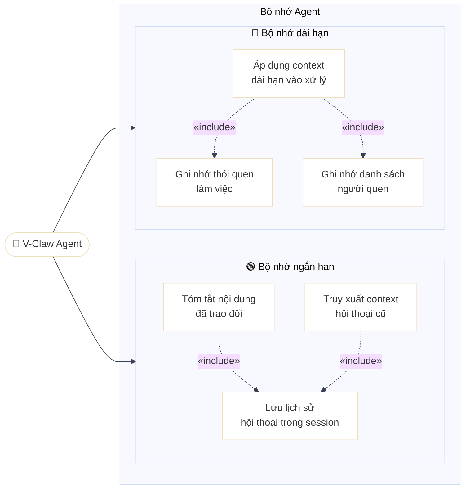
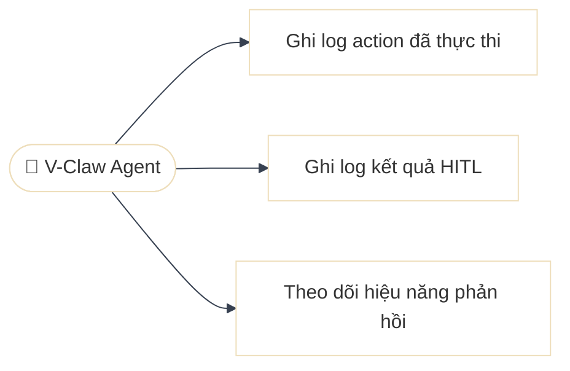

# Usecase Diagram

## Actors

| Actor | Loại | Mô tả |
|---|---|---|
| **Người dùng** | Human | Tương tác qua Telegram / Slack. Không giao tiếp trực tiếp với Google Workspace hay Sandbox. |
| **V-Claw Agent** | AI System | Thực thi tác vụ: phân loại intent, gọi tool, gọi Google Workspace API, chạy Sandbox, điều phối HITL. |

---

## 1. Nhận & Phân loại yêu cầu

---

## 2. Chạy Tool & Multi-step Planning

---

## 3. Tương tác Gmail

---

## 4. Tương tác Calendar

---

## 5. Tương tác Google Chat

---

## 6. Sandbox — Chạy Code Python / Shell

---

## 7. HITL — Human-in-the-Loop

---

## 8. Bộ nhớ

---

## 9. Observability & Log

---
