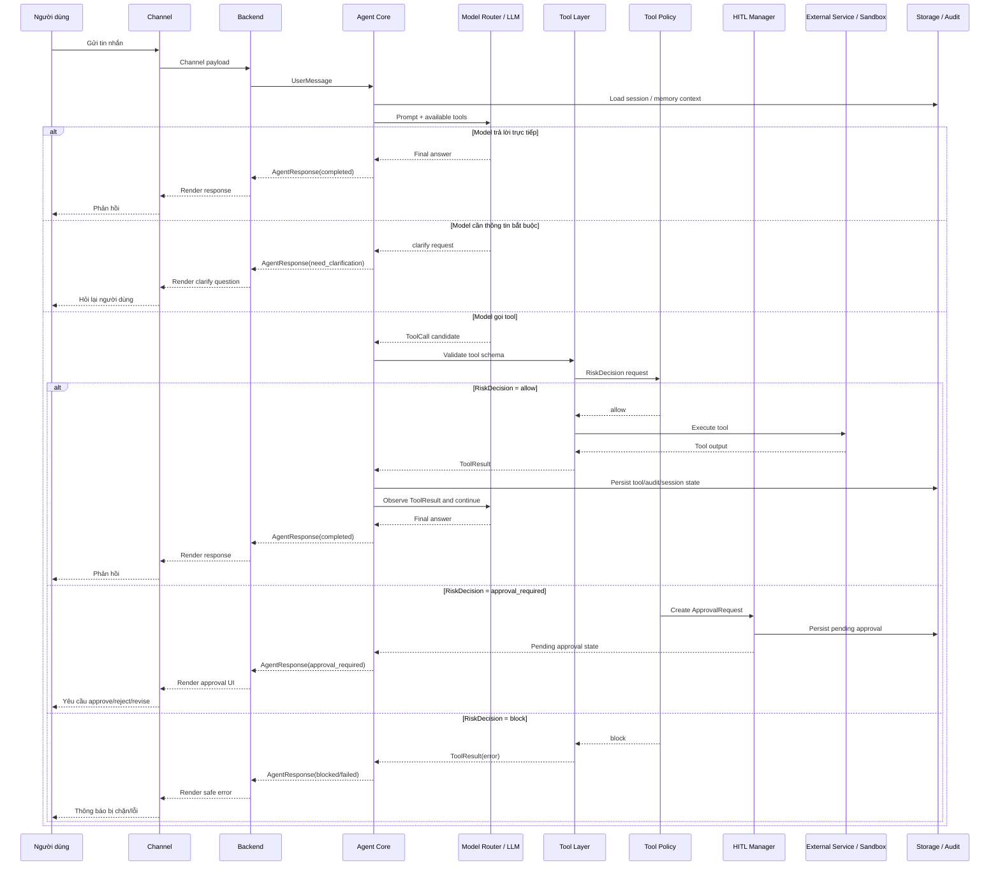

# Canonical Sequence Scenarios

> Mục tiêu: mô tả một số luồng chuẩn đủ dùng để review implementation và thiết kế E2E tests.
> Đây không phải danh sách đầy đủ mọi tổ hợp use case trong `02-usecase-diagram.md`.

---

## 1. Nguyên tắc chọn scenario

Chỉ đưa một sequence diagram vào bộ canonical khi nó đáp ứng ít nhất một tiêu chí:

- Đại diện cho một boundary kiến trúc quan trọng.
- Có thể dùng làm checklist khi hoàn thành một chức năng.
- Có thể chuyển thành E2E hoặc contract test.
- Bao phủ một lớp rủi ro hoặc safety gate khác biệt.
- Bám trực tiếp vào contract trong `03-contracts.md`.

Không tạo sequence diagram riêng cho mọi connector, mọi use case, hoặc mọi biến thể edge case nếu chúng dùng cùng một pattern.

---

## 2. Canonical scenarios hiện tại

| Scenario | Mục đích | Sprint | Contract / boundary chính | File |
|---|---|---:|---|---|
| Channel message to agent response | Luồng nhận tin cơ bản qua channel và trả phản hồi | 1 | `UserMessage`, `AgentResponse` | [01-channel-message.md](scenarios/01-channel-message.md) |
| Gmail read summary | Mẫu Google Workspace đọc thông tin; `gmail.listEmails` an toàn còn `gmail.getEmail` là sensitive read | 1/2 | `gmail.listEmails`, `gmail.getEmail`, `safe_read`, `sensitive_read` | [02-gmail-read-summary.md](scenarios/02-gmail-read-summary.md) |
| Calendar create with HITL | Mẫu external write bắt buộc approval | 2 | `calendar.createEvent`, `RiskDecision`, `ApprovalRequest` | [03-calendar-create-hitl.md](scenarios/03-calendar-create-hitl.md) |
| Sandbox command with HITL | Mẫu code execution/local action bắt buộc approval | 2 | `sandbox.runShell` / `sandbox.runPython`, `code_execution` | [04-sandbox-command-hitl.md](scenarios/04-sandbox-command-hitl.md) |
| Drive / Docs / Sheets read-before-write | Mẫu Google Workspace đọc trước, ghi sau approval | 2+ | `drive.*`, `docs.*`, `sheets.*`, `ApprovalRequest` | [05-drive-docs-sheets-hitl.md](scenarios/05-drive-docs-sheets-hitl.md) |
| Approval revision flow | Mẫu revised request tạo approval mới theo comment | 2 | `ApprovalDecision=revised`, `parentApprovalId` | [05-approval-revision-hitl.md](scenarios/05-approval-revision-hitl.md) |
| Auto-allow policy | Mẫu user policy auto-allow risk thấp | 2 | `UserPolicyConfig`, `auto_allow`, `RiskDecision=allow` | [06-auto-allow-policy.md](scenarios/06-auto-allow-policy.md) |

---

## 3. Cách dùng

Khi review implementation, dùng mỗi scenario như checklist:

1. Input từ channel có được chuẩn hóa đúng contract không?
2. Agent có định tuyến đúng `no_tool` / `tool_enabled` và chỉ hỏi lại khi thiếu thông tin bắt buộc không?
3. Tool name, risk level, error code có khớp `03-contracts.md` không?
4. Side-effect action có dừng trước `ApprovalRequest` không?
5. Tool có chỉ execute sau `ApprovalDecision=approved` không?
6. Response cuối có đi qua channel về người dùng không?
7. Audit/session state có được ghi ở mức tối thiểu theo module hiện hành không?

Nếu một use case mới dùng cùng pattern với scenario đã có, ưu tiên thêm test case/fixture thay vì thêm sequence diagram mới.

---

## 4. Agent Runtime Flow Tổng Quát

Luồng này là processing flow cho lõi AI Agent. Nó bổ sung cho component diagram
trong `01-system-design.md` và bám vào boundary contract trong
`03-contracts.md`.

For production release review, also use
[`production-harness-review.md`](production-harness-review.md). It defines the
harness principles, release blockers, runtime state machine, context
engineering model, and adoption filter for Claude Code-inspired patterns.

Ghi chú:

- `Plan` chỉ là advisory; không cấp quyền execute tool.
- Side-effect tools chỉ được chạy sau khi `RiskDecision` cho phép hoặc approval hợp lệ được duyệt.
- Nếu policy, hook, tool hoặc provider lỗi trong nhánh side-effect, runtime phải fail closed.
- Sau approval, runtime tiếp tục từ pending state đã lưu thay vì tạo tool call mới không liên quan.
- Các scenario chi tiết bên trên là checklist cụ thể cho từng lớp rủi ro/use case.
