# Persistence ERD

> Scope: PostgreSQL persistence for run state, tool calls, approval, tool
> execution, registry metadata, and audit. Session transcript and short-term
> memory remain file-backed JSON under `data/sessions`.

## Source Of Truth

- Contract IDs follow `docs/03-contracts.md`: `requestId`, `sessionId`,
  `toolCallId`, and `approvalId`.
- Existing SQL baseline is `migrations/001_init_vclaw_schema.sql`.
- Current runtime code already has the required persistence interfaces:
  `sessions.Store`, `sessions.MemoryStore`, `agent.RuntimeStateStore`, and
  `audit.AuditEventLogger`.
- Current runtime still has in-memory fallbacks. In particular,
  `Runtime.pendingApprovals` is only a process-local cache; durable lookup must
  use the PostgreSQL-backed runtime state / approval store.

## Required Migration Alignment

The initial migration already creates these baseline tables:

- `agent_runs`
- `tool_registry_entries`
- `risk_decisions`
- `tool_executions`
- `approval_requests`
- `approval_decisions`
- `audit_entries`

To satisfy the persistence task fully, the schema needs these adjustments on
top of the current baseline:

- Add stable `run_id` to run-scoped tables. The Go runtime uses string run IDs
  such as `run_<session>_<request>`, while the current migration only has
  `agent_runs.id uuid`.
- Add runtime state fields to `agent_runs`: `status`, `original_goal`,
  `iteration_count`, `pending_action_id`, `pending_clarification_id`,
  `created_at`, and `updated_at`.
- Add `run_id` to `risk_decisions`, `approval_requests`,
  `approval_decisions`, `tool_executions`, and `audit_entries` so records can be
  queried directly by `run_id`, not only by `session_id` or `request_id`.
- Drop the baseline `session_messages` table. Session transcript and short-term
  memory are persisted by the file session store.
- Add a durable table for proposed tool calls. `tool_executions` is not enough
  because a tool call may stop at policy, clarification, rejection, expiry, or
  pending approval before execution.
- Add a durable table for approval/action state, or extend
  `approval_requests` enough to implement `agent.ActionRecord`. Pending
  approval lookup must be possible after process restart.
- Extend `audit_entries` from the legacy Telegram-style fields to structured
  audit events that can reference run, tool call, approval, execution, and
  policy data.

## Target ERD

```mermaid
erDiagram
    AGENT_RUNS {
        uuid id PK
        text run_id UK
        text request_id UK
        text session_id
        text channel
        text original_goal
        text input_text
        text locale
        text status
        integer iteration_count
        text pending_action_id
        text pending_clarification_id
        text response_status
        text response_message
        jsonb data
        jsonb plan
        jsonb error
        timestamptz started_at
        timestamptz created_at
        timestamptz updated_at
        timestamptz completed_at
    }

    TOOL_REGISTRY_ENTRIES {
        uuid id PK
        text name UK
        text owner
        text description
        jsonb parameters
        text capability
        text risk_level
        boolean requires_approval
        integer timeout_ms
        boolean enabled
        timestamptz created_at
        timestamptz updated_at
    }

    TOOL_CALLS {
        uuid id PK
        text run_id FK
        text request_id
        text session_id
        text tool_call_id UK
        text tool_name FK
        jsonb args_snapshot
        text status
        text reason
        text error_message
        jsonb result
        bigint latency_ms
        timestamptz created_at
        timestamptz updated_at
        timestamptz completed_at
    }

    RISK_DECISIONS {
        uuid id PK
        text run_id FK
        text request_id
        text session_id
        text tool_call_id FK
        text tool_name
        text risk_level
        text decision
        boolean requires_approval
        text reason
        jsonb policy_reasons
        timestamptz checked_at
        timestamptz created_at
    }

    APPROVAL_ACTIONS {
        uuid id PK
        text action_id UK
        text run_id FK
        text request_id
        text session_id
        text tool_call_id FK
        text tool_name
        jsonb args_snapshot
        text risk_level
        text status
        text approval_id UK
        timestamptz approval_expires_at
        text idempotency_key UK
        jsonb result
        timestamptz created_at
        timestamptz updated_at
    }

    APPROVAL_REQUESTS {
        uuid id PK
        text approval_id UK
        text action_id FK
        text run_id FK
        text request_id
        text session_id
        text tool_call_id FK
        text status
        text risk_level
        text summary
        text details
        jsonb tool_call
        timestamptz created_at
        timestamptz expires_at
        timestamptz resolved_at
    }

    APPROVAL_DECISIONS {
        uuid id PK
        text approval_id FK
        text run_id FK
        text request_id
        text session_id
        text decision
        text decided_by
        text channel
        text comment
        timestamptz decided_at
        timestamptz created_at
    }

    TOOL_EXECUTIONS {
        uuid id PK
        text run_id FK
        text request_id
        text session_id
        text tool_call_id FK
        text approval_id FK
        text tool_name
        jsonb input
        text execution_status
        boolean result_success
        jsonb result_data
        jsonb error
        timestamptz requested_at
        timestamptz started_at
        timestamptz completed_at
    }

    AUDIT_ENTRIES {
        uuid id PK
        text event_id UK
        text event_type
        text run_id FK
        text request_id
        text session_id
        text tool_call_id FK
        text approval_id FK
        text execution_id
        text channel
        text actor_ref
        text tool_name
        text action_type
        text risk_level
        text policy_decision
        jsonb policy_reasons
        jsonb affected_resources
        jsonb details
        text output_summary
        text error_message
        timestamptz timestamp
        timestamptz created_at
    }

    AGENT_RUNS ||--o{ TOOL_CALLS : proposes
    TOOL_REGISTRY_ENTRIES ||--o{ TOOL_CALLS : defines
    TOOL_CALLS ||--o{ RISK_DECISIONS : checked_by
    TOOL_CALLS ||--o| APPROVAL_ACTIONS : may_hold
    APPROVAL_ACTIONS ||--|| APPROVAL_REQUESTS : surfaces
    APPROVAL_REQUESTS ||--o{ APPROVAL_DECISIONS : resolved_by
    TOOL_CALLS ||--o| TOOL_EXECUTIONS : executes_as
    APPROVAL_REQUESTS ||--o| TOOL_EXECUTIONS : authorizes
    AGENT_RUNS ||--o{ AUDIT_ENTRIES : audited
    TOOL_CALLS ||--o{ AUDIT_ENTRIES : tool_audited
    APPROVAL_REQUESTS ||--o{ AUDIT_ENTRIES : approval_audited
    TOOL_EXECUTIONS ||--o{ AUDIT_ENTRIES : execution_audited
```



## Table Responsibilities

### `agent_runs`

Stores `agent.RunState` plus the user-facing response envelope. This is the
primary lookup for run state by `run_id`, and the main join point for all
run-scoped records.

Runtime status values should match `agent.RuntimeRunStatus`:

```text
running
waiting_approval
waiting_clarification
completed
failed
blocked
max_iterations
```

### File-Backed Session Store

Short-term transcript and session memory are intentionally stored outside
PostgreSQL in `data/sessions/<session_id>/transcript.json` and
`data/sessions/<session_id>/memory.json`. The PostgreSQL schema keeps
run/tool/approval/audit records only.

### `tool_calls`

Stores proposed tool calls before and after execution. This table fills the gap
between transcript messages and `tool_executions`.

Recommended status values:

```text
proposed
allowed
requires_approval
blocked
waiting_clarification
skipped
executing
completed
failed
```

### `risk_decisions`

Stores every policy decision. Even blocked or approval-required actions should
leave a queryable risk record.

Decision values must match `contracts.RiskDecisionStatus`:

```text
allow
requires_approval
block
```

### `approval_actions`

Durable implementation backing for `agent.ActionRecord`. This is what prevents
pending approvals from depending only on `Runtime.pendingApprovals`.

Recommended status values should match `agent.ActionStatus`:

```text
pending_approval
approved
executing
completed
failed
rejected
expired
superseded
```

Required pending approval lookup:

```sql
SELECT *
FROM approval_actions
WHERE session_id = $1
  AND status = 'pending_approval'
  AND approval_expires_at > now()
ORDER BY created_at DESC
LIMIT 1;
```

### `approval_requests` And `approval_decisions`

`approval_requests` stores the user-facing approval proposal, including the full
canonical `contracts.ToolCall` snapshot in `tool_call`.

`approval_decisions` stores the user's approve/reject event. Decisions are
append-only; the current approval status is reflected back into
`approval_requests.status` and `approval_actions.status`.

### `tool_executions`

Stores execution attempts and result payloads. A side-effect tool must only get
a row with `execution_status = 'executing'` after policy allows it or after an
approved `approval_id` is present.

Recommended execution status values:

```text
requested
executing
completed
failed
timeout
blocked
```

### `audit_entries`

Stores audit evidence for run, policy, approval, and execution lifecycle
events. This table should support both the legacy `audit.Entry` style and the
newer structured `audit.AuditEvent` style.

Recommended event types:

```text
agent.run.started
agent.run.completed
agent.run.failed
tool.call.requested
safety.risk.checked
safety.action.blocked
approval.requested
approval.approved
approval.rejected
approval.expired
tool.call.started
tool.call.completed
tool.call.failed
```

## Required Indexes

Keep the existing migration indexes and add these for the persistence task:

```sql
CREATE UNIQUE INDEX idx_agent_runs_run_id ON agent_runs(run_id);
CREATE INDEX idx_agent_runs_session_status ON agent_runs(session_id, status);

CREATE INDEX idx_tool_calls_run_created_at
    ON tool_calls(run_id, created_at);
CREATE INDEX idx_tool_calls_session_created_at
    ON tool_calls(session_id, created_at);
CREATE UNIQUE INDEX idx_tool_calls_tool_call_id
    ON tool_calls(tool_call_id);

CREATE INDEX idx_risk_decisions_run_id
    ON risk_decisions(run_id);
CREATE INDEX idx_risk_decisions_tool_call_id
    ON risk_decisions(tool_call_id);

CREATE UNIQUE INDEX idx_approval_actions_action_id
    ON approval_actions(action_id);
CREATE UNIQUE INDEX idx_approval_actions_approval_id
    ON approval_actions(approval_id);
CREATE UNIQUE INDEX idx_approval_actions_idempotency_key
    ON approval_actions(idempotency_key);
CREATE INDEX idx_approval_actions_pending_session
    ON approval_actions(session_id, status, approval_expires_at);
CREATE INDEX idx_approval_actions_run_status
    ON approval_actions(run_id, status);

CREATE INDEX idx_approval_requests_run_status
    ON approval_requests(run_id, status);
CREATE INDEX idx_approval_requests_session_status
    ON approval_requests(session_id, status);

CREATE INDEX idx_approval_decisions_run_id
    ON approval_decisions(run_id);
CREATE INDEX idx_approval_decisions_session_id
    ON approval_decisions(session_id);

CREATE INDEX idx_tool_executions_run_id
    ON tool_executions(run_id);
CREATE INDEX idx_tool_executions_session_id
    ON tool_executions(session_id);

CREATE INDEX idx_audit_entries_run_timestamp
    ON audit_entries(run_id, timestamp);
CREATE INDEX idx_audit_entries_session_timestamp
    ON audit_entries(session_id, timestamp);
CREATE INDEX idx_audit_entries_tool_call_id
    ON audit_entries(tool_call_id);
CREATE INDEX idx_audit_entries_approval_id
    ON audit_entries(approval_id);
```

## Implementation Checklist

- `sessions.Store` and `sessions.MemoryStore` use file-backed JSON under
  `data/sessions`.
- `agent.RuntimeStateStore.CreateRun/GetRun/UpdateRun` maps to `agent_runs`.
- `agent.RuntimeStateStore.FindOrCreateAction` maps to `approval_actions` with
  `idempotency_key` enforcing retry safety.
- `FindLatestPendingApproval` queries `approval_actions`, not
  `Runtime.pendingApprovals`.
- `GetActionByApprovalID`, `MarkActionApproved`, `MarkActionRejected`,
  `MarkActionExpired`, `TryMarkActionExecuting`, `CompleteAction`, and
  `FailAction` update `approval_actions` transactionally.
- Approval request creation writes both `approval_actions` and
  `approval_requests` in the same transaction.
- Approval decision handling writes `approval_decisions` and updates
  `approval_requests.status` / `approval_actions.status` in the same
  transaction.
- `RecordToolCall` writes `tool_calls` and `tool_executions` when execution
  starts or finishes.
- Audit logging writes `audit_entries` for risk decision, approval request,
  approval decision, execution start, execution result, and blocked actions.

## Acceptance Queries

These queries should be possible without reading process memory:

```sql
-- Full run state.
SELECT * FROM agent_runs WHERE run_id = $1;

-- Pending approval after restart.
SELECT ar.*, req.tool_call
FROM approval_actions ar
JOIN approval_requests req ON req.approval_id = ar.approval_id
WHERE ar.session_id = $1
  AND ar.status = 'pending_approval'
  AND ar.approval_expires_at > now()
ORDER BY ar.created_at DESC
LIMIT 1;

-- Tool calls and executions for a run.
SELECT * FROM tool_calls
WHERE run_id = $1
ORDER BY created_at, id;

SELECT * FROM tool_executions
WHERE run_id = $1
ORDER BY requested_at, id;

-- Approval history for a run.
SELECT req.*, dec.decision, dec.decided_by, dec.decided_at, dec.comment
FROM approval_requests req
LEFT JOIN approval_decisions dec ON dec.approval_id = req.approval_id
WHERE req.run_id = $1
ORDER BY req.created_at, dec.created_at;

-- Audit trail for a session or run.
SELECT * FROM audit_entries
WHERE session_id = $1
ORDER BY timestamp, id;

SELECT * FROM audit_entries
WHERE run_id = $1
ORDER BY timestamp, id;
```
	
