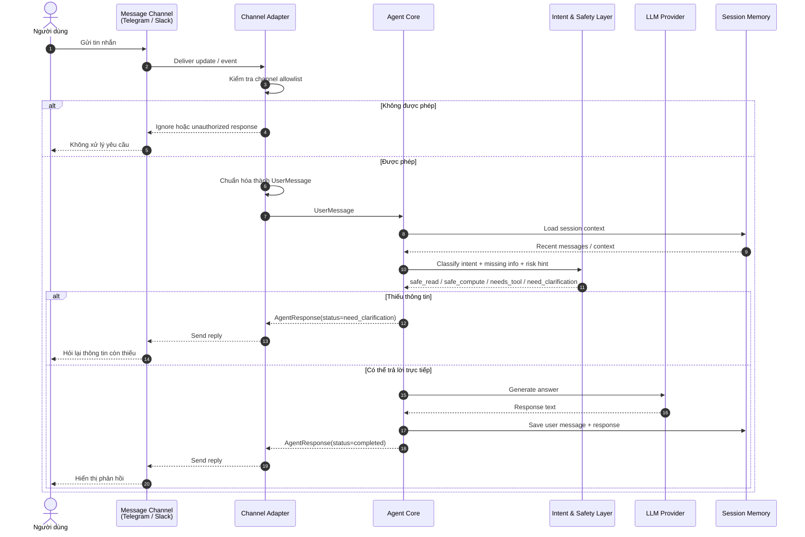

# Scenario 01: Channel Message To Agent Response

## Purpose

Luồng chuẩn cho việc nhận một tin nhắn từ Telegram/Slack, chuẩn hóa thành `UserMessage`, đưa vào Agent Core và trả `AgentResponse`.

Scenario này đại diện cho:

- Sprint 1 G3: nhận diện intent cơ bản.
- Sprint 1 G4: channel Telegram/Slack.
- Sprint 1 G5: agent loop tối giản.

Không mô tả login/logout. `allowed_user_id` hoặc `allowed_chat_id` là allowlist của channel trong single-owner deployment.

## Sequence

## Implementation Checklist

- Channel adapter chỉ chuẩn hóa input thành `UserMessage`; không chứa agent reasoning.
- Runtime contract không thêm `userId`; owner được kiểm soát ở channel/config boundary.
- Missing information trả `AgentResponse.status=need_clarification`.
- Không gọi tool nếu intent chỉ là chat hoặc hỏi đáp thường.
- Session memory là ngắn hạn; không phụ thuộc long-term memory trong Sprint 1.
