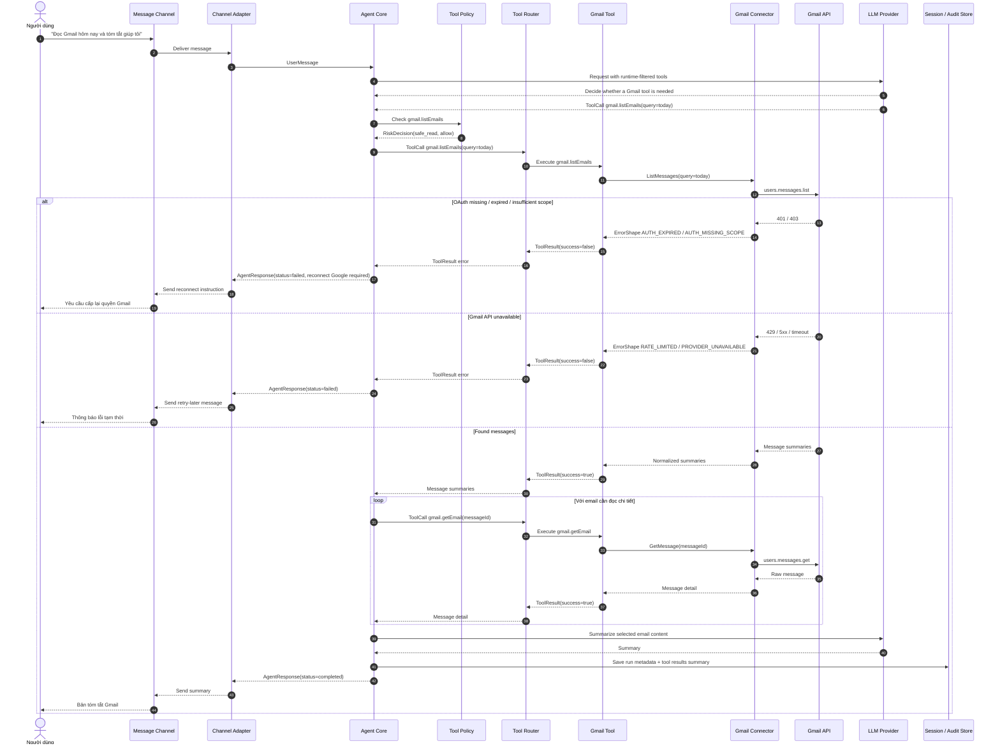

# Scenario 02: Read-Only Gmail Summary

## Purpose

Luồng chuẩn cho thao tác Google Workspace read-only: đọc email theo điều kiện, lấy nội dung cần thiết và tóm tắt cho người dùng.

Scenario này đại diện cho:

- Gmail read-only tools.
- OAuth Google Workspace như external account link/refresh, không phải login của V-Claw.
- Tool execution không cần HITL vì risk level là `safe_read`.

## Sequence

## Implementation Checklist

- Tool names phải là `gmail.listEmails` và `gmail.getEmail`.
- Read-only Gmail flow không tạo `ApprovalRequest`.
- OAuth failure trả lỗi theo `ErrorShape`, ví dụ `AUTH_EXPIRED` hoặc `AUTH_MISSING_SCOPE`.
- Gmail connector chỉ gọi API và normalize response; không chứa agent reasoning.
- Gmail tool chịu trách nhiệm render nội dung hiển thị an toàn cho Agent/User.
- Audit/session store chỉ ghi metadata hoặc dữ liệu đã redacted khi cần.
