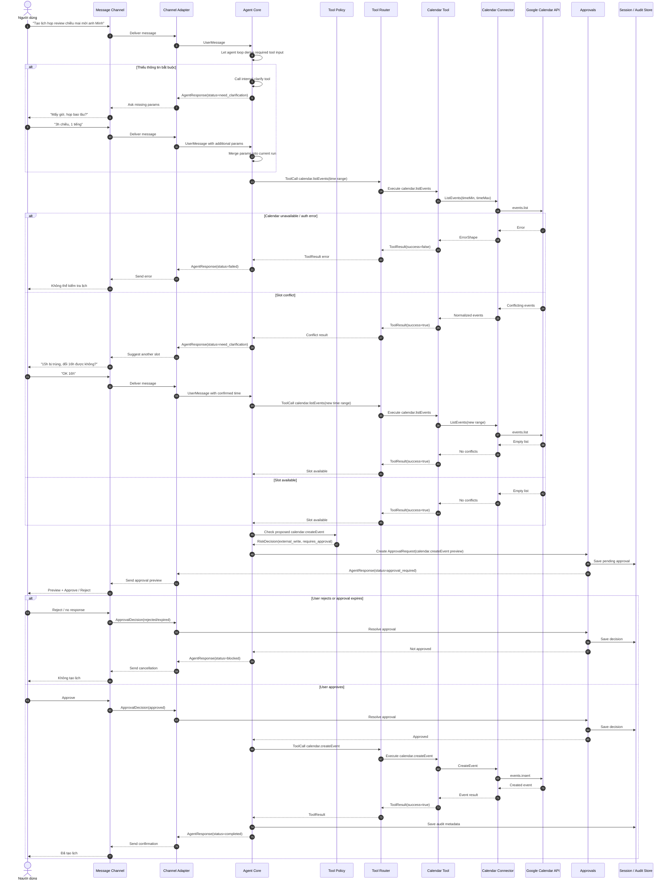

# Scenario 03: Calendar Create With HITL

## Purpose

Luồng chuẩn cho external write: Agent đề xuất tạo Calendar event, nhưng chỉ execute sau khi người dùng approve.

Scenario này đại diện cho:

- Missing information handling.
- Read-before-write conflict check.
- `RiskDecision` và `ApprovalRequest`.
- Rule: không execute side effect trước approval.

## Sequence

## Implementation Checklist

- `calendar.listEvents` là read-only và có thể chạy trước approval.
- `calendar.createEvent` không được execute trước `ApprovalDecision=approved`.
- `ApprovalRequest` phải chứa preview đủ rõ: title, time, attendees, side effect.
- Reject, expire hoặc cancel đều không được gọi `calendar.createEvent`.
- Conflict handling là hỏi lại/đề xuất slot, không tự chọn giờ mới nếu người dùng chưa xác nhận.
- Tool/result/error code phải khớp `03-contracts.md`.
