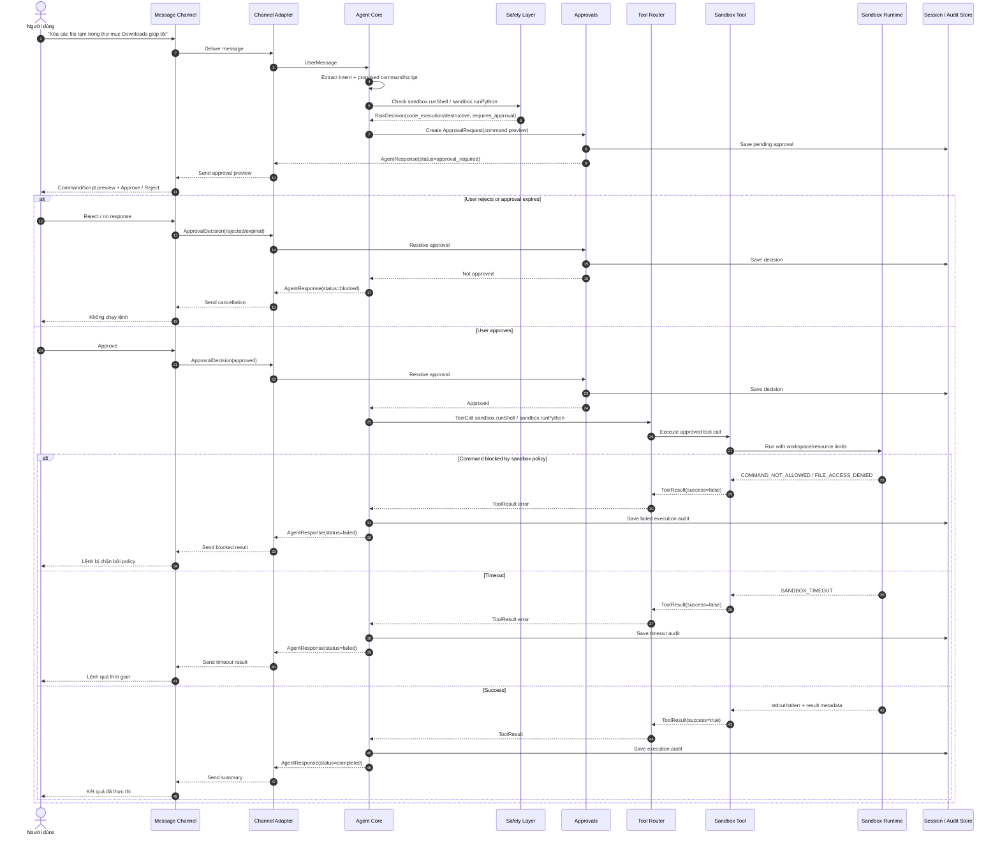

# Scenario 04: Sandbox Command With HITL

## Purpose

Luồng chuẩn cho code execution hoặc local file action qua sandbox. Đây là pattern bắt buộc approval trước khi chạy Python/Shell.

Scenario này đại diện cho:

- Sprint 2 G1: chạy Python/Shell trong sandbox.
- Sprint 2 G2: HITL trước command/code execution.
- Contract E2E "Shell Command Requires Approval".

## Sequence

## Implementation Checklist

- Không chạy Python/Shell trước `ApprovalDecision=approved`.
- Approval preview phải hiển thị command/script, target path và tác động dự kiến.
- Sandbox vẫn phải enforce policy sau approval; approval không bỏ qua sandbox policy.
- Timeout/output limit phải được chuyển thành `SANDBOX_TIMEOUT` hoặc error tương ứng.
- Mọi kết quả thực thi phải được audit ở mức metadata/redacted phù hợp.
- Không mô tả `MEDIUM/HIGH`; dùng risk level contract như `code_execution` hoặc `destructive`.
