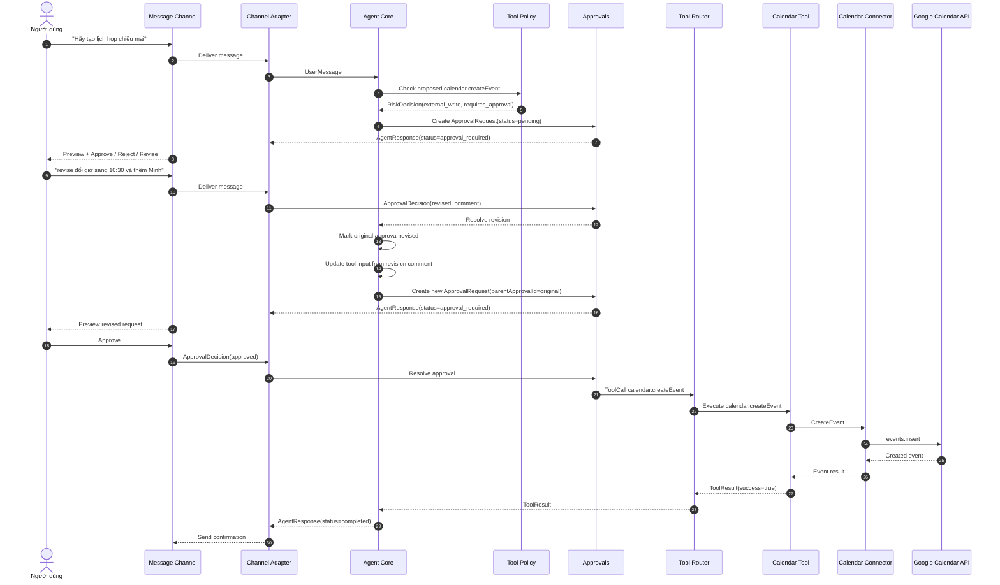

# Scenario 05: Approval Revision Flow

## Purpose

Luồng chuẩn khi người dùng không muốn reject hẳn một hành động đang chờ, mà muốn chỉnh lại nội dung rồi xin duyệt lại.

Scenario này đại diện cho:

- `ApprovalDecision=revised`
- `parentApprovalId` trên approval mới
- Agent cập nhật input theo comment của user trước khi tạo approval request mới

## Sequence

## Implementation Checklist

- `revised` must be a valid approval decision and a valid approval request status.
- The revised approval request must carry `parentApprovalId`.
- The original pending approval must stop being treated as pending once revised.
- The revised tool input should come from the user comment plus the agent's update pass.
- No external write may execute before the revised request is approved.

