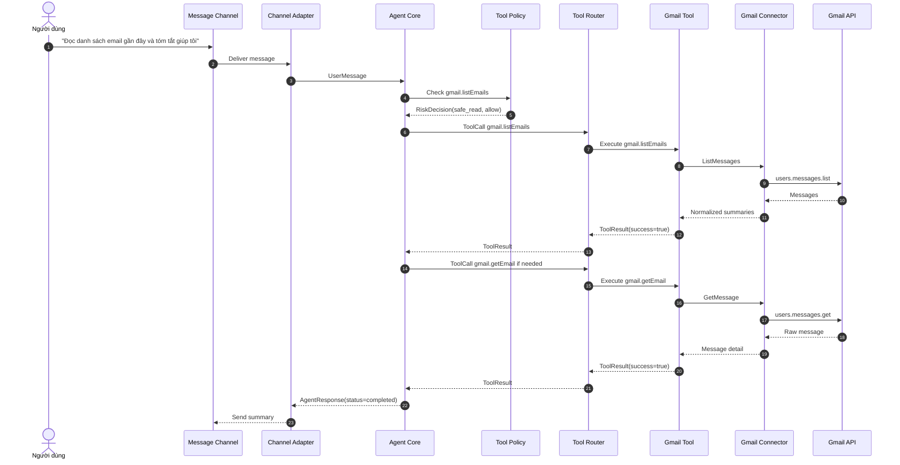

# Scenario 06: Auto-Allow Policy

## Purpose

Luồng chuẩn khi owner cấu hình policy để tự động cho qua các risk level thấp, không cần tạo approval request.

Scenario này đại diện cho:

- `UserPolicyConfig.auto_allow`
- `RiskDecision=allow` từ policy layer
- Tool execution đi thẳng qua router khi không cần HITL

## Sequence

## Implementation Checklist

- `auto_allow` phải được lưu trong `UserPolicyConfig`.
- Nếu risk level nằm trong `auto_allow`, policy layer phải trả `allow`.
- Không tạo `ApprovalRequest` cho risk level đã auto-allowed.
- Luồng này vẫn phải ghi nhận `RiskDecision` để audit.

