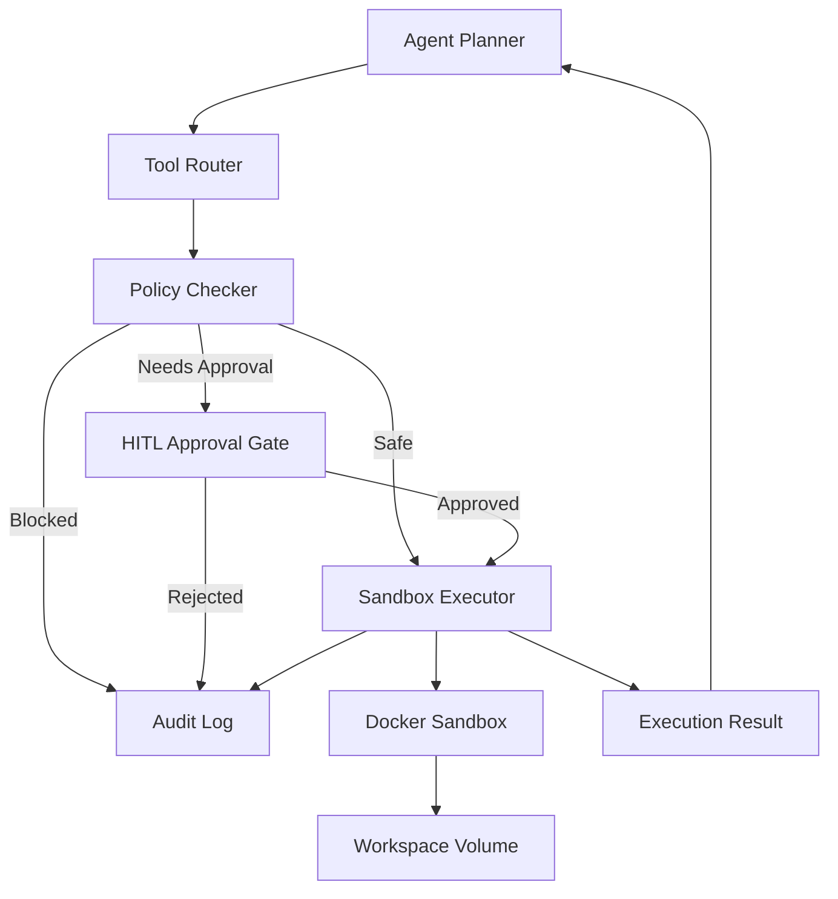

# Kế Hoạch Scrum - Nhóm Hệ Thống & Sandbox

Tài liệu này chia nhỏ công việc cho **Nhóm Hệ Thống & Sandbox** gồm 2 thành viên trong dự án V-Claw. Mục tiêu của nhóm là xây dựng môi trường an toàn để AI Agent có thể chạy Python/Shell, thao tác file và dữ liệu trên máy tính, đồng thời bắt buộc đi qua cơ chế HITL với các hành động nguy hiểm.

## 1. Phạm Vi Phụ Trách

Nhóm Hệ Thống & Sandbox phụ trách các hạng mục sau:

- Thiết lập sandbox/Docker để chạy Python và Shell an toàn.
- Giới hạn quyền truy cập file, thư mục, tài nguyên CPU/RAM/thời gian.
- Xây dựng execution engine cho các tool `run_python`, `run_shell`, `file_ops`.
- Tích hợp policy checker trước khi thực thi lệnh.
- Tích hợp HITL gate cho hành động nguy hiểm như xóa file, ghi đè hàng loạt, chạy lệnh hệ thống sâu.
- Ghi audit log cho mỗi lệnh được đề xuất, được duyệt, bị từ chối hoặc bị chặn.
- Hỗ trợ các tác vụ văn phòng trong sandbox: đọc Excel, tạo/sửa Word, gom file, lọc dữ liệu.

Nhóm không phụ trách trực tiếp:

- Kết nối Gmail, Calendar, Google Chat.
- Xây dựng LLM planner chính.
- Xây dựng long-term memory/knowledge graph.
- Xây dựng giao diện UI đầy đủ, trừ phần contract cho HITL.

## 2. Phân Vai 2 Thành Viên

| Vai trò | Thành viên | Phạm vi chính |
|---|---|---|
| Sandbox Runtime Owner | Người A | Docker, execution engine, filesystem workspace, Python/Shell runner, resource limit |
| Security & HITL Owner | Người B | Policy matrix, dangerous command detection, HITL approval contract, audit log, security tests |

Nguyên tắc làm việc:

- Người A và B làm song song trên hai nhánh công việc độc lập.
- Điểm ghép chung là pipeline: `Tool Request -> Policy Checker -> HITL Gate -> Sandbox Executor -> Audit Log`.
- Mỗi API/contract cần có input/output schema rõ ràng để nhóm Agent có thể tích hợp.
- Mỗi hành động nguy hiểm mặc định không được chạy trực tiếp nếu chưa có approve.

## 3. Kiến Trúc Dự Kiến



## 4. Risk Taxonomy

| Mức độ | Mô tả | Ví dụ | Cách xử lý |
|---|---|---|---|
| `safe_read` | Chỉ đọc thông tin | List file, đọc CSV/XLSX, xem metadata | Cho chạy |
| `safe_write` | Tạo file mới trong workspace | Tạo report Word, tạo folder output | Cho chạy hoặc yêu cầu xác nhận nhẹ tùy cấu hình |
| `needs_approval` | Có thể thay đổi/xóa dữ liệu | Xóa file, ghi đè file, rename hàng loạt | Bắt buộc HITL |
| `high_risk` | Lệnh hệ thống sâu hoặc tác động ngoài sandbox | Shutdown, sửa registry, chmod/chown sâu, service control | Chặn hoặc HITL nghiêm ngặt |
| `external_network` | Gửi/tải dữ liệu qua mạng | curl domain lạ, upload file | HITL và log đầy đủ |
| `credential_access` | Cố gắng đọc token, key, password | `.env`, credential store, private key | Chặn mặc định |

## 5. Product Backlog

### Epic 1: Sandbox Runtime

**User Story 1:** Là Agent, tôi muốn chạy Python code trong môi trường cô lập để xử lý dữ liệu mà không ảnh hưởng máy thật.

Acceptance Criteria:

- Code chạy trong Docker container.
- Container không chạy bằng quyền root.
- Có timeout cho từng job.
- Có giới hạn CPU/RAM.
- Chỉ truy cập được workspace được phép.

**User Story 2:** Là Agent, tôi muốn chạy shell command đơn giản để thao tác file.

Acceptance Criteria:

- Lệnh read-only được chạy nếu policy cho phép.
- Lệnh write/delete được phân loại đúng.
- Lệnh nguy hiểm bị chặn hoặc chuyển sang HITL.
- Output stdout/stderr được trả về có giới hạn dung lượng.

### Epic 2: HITL & Safety

**User Story 3:** Là người dùng, tôi muốn AI hỏi trước khi chạy lệnh nguy hiểm.

Acceptance Criteria:

- Hệ thống trả về proposal thay vì chạy ngay.
- Proposal có giải thích bằng tiếng Việt.
- Proposal hiển thị lệnh, file/thư mục bị ảnh hưởng, rủi ro và lý do cần duyệt.
- Chỉ khi user approve thì lệnh mới được execute.
- Nếu user reject thì không thực thi và phải ghi log.

**User Story 4:** Là dev/admin, tôi muốn xem lại lịch sử hành động sandbox.

Acceptance Criteria:

- Log mọi command/tool request.
- Log risk level.
- Log trạng thái: proposed, approved, rejected, blocked, executed, failed.
- Log timestamp, user/session id, command hash, output summary.

### Epic 3: Office File Automation

**User Story 5:** Là người dùng, tôi muốn AI đọc Excel và tạo Word report trong sandbox.

Acceptance Criteria:

- Đọc được `.xlsx`, `.csv`.
- Tạo được `.docx`.
- File output nằm trong workspace được phép.
- Nếu ghi đè file cũ thì phải qua HITL.

### Epic 4: Security Hardening

**User Story 6:** Là người dùng, tôi muốn sandbox ngăn việc đọc file ngoài workspace.

Acceptance Criteria:

- Chặn path traversal như `../`.
- Chặn truy cập absolute path ngoài allowlist.
- Chặn truy cập credential files mặc định.
- Có test cho các case bypass phổ biến.

## 6. Sprint 1 - Kết Nối Nền Tảng Sandbox & Nhận Diện Risk

### Sprint Goal

Có sandbox cơ bản để Agent có thể gửi yêu cầu chạy Python/Shell, đồng thời mọi request đều được policy checker phân loại trước khi thực thi.

### Task Breakdown

| ID | Task | Người | Mô tả | Output | Priority |
|---|---|---|---|---|---|
| S1-T1 | Thiết kế sandbox architecture | A | Vẽ luồng Agent -> Tool Router -> Policy -> Executor -> Docker | Diagram và ghi chú kỹ thuật | High |
| S1-T2 | Tạo Docker image Python cơ bản | A | Python runtime, pip, non-root user, `/workspace` | Dockerfile trong `internal/sandbox/docker` | High |
| S1-T3 | Xây dựng command runner interface | A | Định nghĩa interface cho `run_python`, `run_shell` | Go interface/schema | High |
| S1-T4 | Implement timeout cơ bản | A | Giới hạn thời gian chạy của job | Job timeout config | High |
| S1-T5 | Giới hạn working directory | A | Tất cả lệnh chạy trong workspace riêng | Workspace guard | High |
| S1-T6 | Thiết kế permission model | B | Các mức `safe_read`, `safe_write`, `needs_approval`, `blocked` | Policy matrix | High |
| S1-T7 | Rule phát hiện lệnh nguy hiểm ban đầu | B | Detect xóa file, shutdown, registry, service, credential path | Rule list và unit test | High |
| S1-T8 | Thiết kế audit log schema | B | Schema cho command proposal và execution result | Struct/schema docs | Medium |
| S1-T9 | Test policy cho command mẫu | B | Test đọc file, tạo file, xóa file, command hệ thống | Policy test cases | High |
| S1-T10 | Ghép policy với executor | A + B | Request phải qua policy trước khi chạy | Flow end-to-end local | High |
| S1-T11| Tích hợp thử Tool Router với Sandbox API | A | Agent/tool gọi được sandbox qua interface thống nhất|||

### Kế Hoạch Song Song Theo Ngày

| Ngày | Người A | Người B |
|---|---|---|
| Day 1 | Thiết kế Docker sandbox và workspace layout | Thiết kế risk taxonomy và policy matrix |
| Day 2 | Tạo Dockerfile và chạy Python mẫu | Viết rule detect command nguy hiểm |
| Day 3 | Tạo interface `run_python`, `run_shell` | Thiết kế audit log schema |
| Day 4 | Thêm timeout và working directory guard | Viết unit test cho policy |
| Day 5 | Ghép executor với policy checker | Test end-to-end và chốt HITL contract cho Sprint 2 |

### Definition of Done

- Chạy được Python code đơn giản trong Docker.
- Chạy được shell command đơn giản trong Docker.
- Lệnh được phân loại trước khi execute.
- Lệnh nguy hiểm không được chạy trực tiếp.
- Có test policy cơ bản.
- Có tài liệu API/contract ban đầu cho nhóm Agent.

## 7. Sprint 2 - File Automation, HITL & Office Tasks

### Sprint Goal

Agent có thể xử lý file và dữ liệu văn phòng trong sandbox. Mọi hành động thay đổi nguy hiểm phải dừng lại cho user duyệt kèm giải thích rõ bằng tiếng Việt.

### Task Breakdown

| ID | Task | Người | Mô tả | Output | Priority |
|---|---|---|---|---|---|
| S2-T1 | Thêm filesystem sandbox volume | A | Mount workspace riêng cho từng session/job | Workspace volume config | High |
| S2-T2 | Implement safe file operations | A | List, read, copy, create folder, create file | File ops tool | High |
| S2-T3 | Hỗ trợ Python office libraries | A | Thêm pandas, openpyxl, python-docx | Docker image update | High |
| S2-T4 | Tạo job wrapper | A | Job id, status, stdout/stderr, exit code | Job execution model | Medium |
| S2-T5 | Giới hạn output size | A | Cắt stdout/stderr quá dài, trả summary | Output limiter | Medium |
| S2-T6 | HITL proposal contract | B | Định nghĩa payload cần duyệt | Approval request schema | High |
| S2-T7 | Nội dung consent tiếng Việt | B | Message: AI định làm gì, lệnh nào, rủi ro nào | Template consent | High |
| S2-T8 | Approve/reject flow | B | Approved mới execute, rejected thì log | HITL state machine | High |
| S2-T9 | Audit log HITL | B | Ghi proposed/approved/rejected/executed | Audit events | High |
| S2-T10 | Policy cho ghi đè/xóa file | B | Ghi đè, delete, bulk rename bắt buộc HITL | File mutation rules | High |
| S2-T11 | End-to-end file scenario | A + B | Đọc Excel -> lọc dữ liệu -> tạo Word report | Demo workflow | High |
| S2-T12 | End-to-end danger scenario | A + B | Xóa file/ghi đè file -> proposal -> approve/reject | HITL demo | High |

### Mẫu HITL Proposal

```json
{
  "approval_id": "appr_123",
  "risk_level": "needs_approval",
  "action_type": "file_delete",
  "summary_vi": "AI muốn xóa 3 file trong thư mục workspace/output.",
  "reason_vi": "Yêu cầu của người dùng có nội dung dọn dẹp file tạm, nhưng hành động xóa file có thể làm mất dữ liệu.",
  "command_preview": "rm workspace/output/*.tmp",
  "affected_paths": [
    "workspace/output/a.tmp",
    "workspace/output/b.tmp"
  ],
  "requires_user_action": true
}
```

### Definition of Done

- Agent chạy được Python/Shell trong sandbox để xử lý file.
- Đọc được Excel và tạo được Word report mẫu.
- Delete/overwrite/bulk mutation bắt buộc qua HITL.
- User thấy giải thích tiếng Việt trước khi duyệt.
- Approve mới execute, reject không execute.
- Mọi bước được audit log.

## 8. Sprint 3 - Hardening, Observability & Release Readiness

### Sprint Goal

Sandbox đủ ổn định để demo tích hợp thực tế, có test bảo mật, có log để truy vết, có tài liệu vận hành.

### Task Breakdown

| ID | Task | Người | Mô tả | Output | Priority |
|---|---|---|---|---|---|
| S3-T1 | Tối ưu cold start | A | Reuse image/container nếu phù hợp | Faster job start | Medium |
| S3-T2 | Quản lý lifecycle job | A | Cleanup job cũ, giới hạn job song song | Job manager | High |
| S3-T3 | Resource monitoring | A | Ghi CPU/RAM/runtime/output size | Job metrics | Medium |
| S3-T4 | Chuẩn hóa execution API | A | Input/output/error schema ổn định cho Agent team | API contract | High |
| S3-T5 | Chuẩn hóa workspace cleanup | A | Cleanup file tạm, giữ artifact cần thiết | Cleanup policy | Medium |
| S3-T6 | Hoàn thiện policy matrix | B | Bảng quyền theo action/file/network/credential | Final policy docs | High |
| S3-T7 | Security test path traversal | B | Test `../`, absolute path, symlink nếu có | Security tests | High |
| S3-T8 | Security test command injection | B | Test shell metacharacter, chained commands | Security tests | High |
| S3-T9 | Log viewer đơn giản | B | CLI/API doc để xem audit log | Log viewer MVP | Medium |
| S3-T10 | Release safety checklist | B | Checklist demo và release nội bộ | Release checklist | Medium |
| S3-T11 | Tích hợp kịch bản thực tế | A + B | Gom tài liệu, đọc Excel, tạo report, HITL xóa file | E2E test suite | High |
| S3-T12 | Tài liệu vận hành sandbox | A + B | Cách build, run, config, debug, thêm policy | Ops docs | High |

### Definition of Done

- API execution ổn định cho nhóm Agent sử dụng.
- Có security tests cho path traversal và command injection.
- Có log đủ để truy vết từng hành động.
- Có demo end-to-end với HITL.
- Có tài liệu setup, run, debug và policy.

## 9. Dependency Với Các Nhóm Khác

| Nhóm | Nhóm mình cần từ họ | Nhóm họ cần từ mình |
|---|---|---|
| Agent & Bộ nhớ | Tool request schema, intent/risk metadata | Execution API, policy result, HITL proposal |
| Google API | File/email attachment metadata | Safe workspace path để lưu attachment |
| Giao tiếp Telegram/Slack | Approval UI/action button format | Approval payload và approve/reject endpoint |
| Audit/Store | Database convention nếu có | Audit event schema |
| UI/Local API | Cách hiển thị consent | HITL contract, status lifecycle |

## 10. API Contract Đề Xuất

### Tool Request

```json
{
  "request_id": "req_123",
  "session_id": "sess_abc",
  "user_id": "user_001",
  "tool": "run_shell",
  "input": {
    "command": "ls workspace/input",
    "working_dir": "workspace"
  },
  "context": {
    "user_intent": "đọc danh sách file",
    "source": "agent"
  }
}
```

### Policy Result

```json
{
  "request_id": "req_123",
  "decision": "allow",
  "risk_level": "safe_read",
  "reasons": [
    "Lệnh chỉ đọc danh sách file trong workspace."
  ]
}
```

Giá trị `decision`:

- `allow`: Cho execute ngay.
- `needs_approval`: Tạo approval proposal, chưa execute.
- `block`: Chặn hoàn toàn.

### Execution Result

```json
{
  "request_id": "req_123",
  "job_id": "job_456",
  "status": "success",
  "exit_code": 0,
  "stdout": "input.xlsx\nnotes.docx\n",
  "stderr": "",
  "duration_ms": 214,
  "artifacts": []
}
```

## 11. Audit Log Schema Đề Xuất

```json
{
  "event_id": "evt_001",
  "timestamp": "2026-06-01T10:30:00+07:00",
  "session_id": "sess_abc",
  "user_id": "user_001",
  "request_id": "req_123",
  "job_id": "job_456",
  "tool": "run_shell",
  "action_type": "file_delete",
  "risk_level": "needs_approval",
  "decision": "approved",
  "command_hash": "sha256:...",
  "command_preview": "rm workspace/output/*.tmp",
  "affected_paths": [
    "workspace/output/a.tmp"
  ],
  "result_status": "success",
  "output_summary": "Deleted 1 temporary file."
}
```

## 12. Test Plan

### Functional Tests

| Test | Expected |
|---|---|
| Chạy Python `print("hello")` | Thành công, trả stdout |
| Chạy shell list file trong workspace | Thành công |
| Đọc file CSV/XLSX | Thành công |
| Tạo file Word report | Thành công |
| Ghi file mới trong workspace | Thành công hoặc cần approve tùy policy |
| Ghi đè file có sẵn | Cần HITL |
| Xóa file | Cần HITL |
| User reject xóa file | File không bị xóa, log rejected |
| User approve xóa file | Lệnh mới được execute, log approved/executed |

### Security Tests

| Test | Expected |
|---|---|
| Đọc `../secrets.txt` | Block |
| Đọc absolute path ngoài workspace | Block |
| Đọc `.env`, private key, token | Block |
| Chạy command `shutdown` | Block hoặc HITL nghiêm ngặt |
| Chạy command có chained destructive operation | Needs approval hoặc block |
| Command timeout | Job bị stop và log timeout |
| Output quá lớn | Output bị truncate, không làm treo agent |
| Truy cập network domain lạ | Needs approval hoặc block |

## 13. Scrum Ceremonies

### Sprint Planning

Input:

- Sprint goal của dự án.
- Contract mới nhất từ nhóm Agent/UI.
- Danh sách risk/action mới cần policy.

Output:

- Sprint backlog cho Người A và B.
- API contract cần giao cho nhóm khác.
- Definition of Done rõ ràng.

### Daily Standup

Mỗi người trả lời 3 ý:

- Hôm qua đã làm gì?
- Hôm nay làm gì?
- Có block nào cần người kia hoặc nhóm khác xử lý?

### Sprint Review

Demo bắt buộc:

- Một task an toàn chạy thẳng trong sandbox.
- Một task nguy hiểm bị dừng lại tại HITL.
- Approve thì chạy, reject thì không chạy.
- Audit log ghi đúng.

### Retrospective

Tập trung vào:

- Policy có quá chặt hoặc quá lỏng không?
- HITL message có dễ hiểu với người dùng Việt Nam không?
- Sandbox có quá chậm không?
- Test security còn thiếu trường hợp nào?

## 14. Checklist Release Nội Bộ

- [ ] Docker image build được từ repo.
- [ ] Sandbox không chạy bằng root.
- [ ] Workspace được giới hạn rõ.
- [ ] Timeout hoạt động.
- [ ] Output size limit hoạt động.
- [ ] Policy checker được gọi trước executor.
- [ ] Delete/overwrite/bulk mutation cần HITL.
- [ ] Credential access bị block.
- [ ] Audit log ghi proposed/approved/rejected/executed/failed.
- [ ] Có test path traversal.
- [ ] Có test command injection.
- [ ] Có demo đọc Excel -> tạo Word.
- [ ] Có demo xóa file -> HITL.
- [ ] Có tài liệu run/debug.

## 15. Công Việc Nên Bắt Đầu Ngay

### Người A

1. Tạo Dockerfile sandbox Python trong `internal/sandbox/docker`.
2. Định nghĩa interface `run_python`, `run_shell`.
3. Thêm timeout và workspace guard.
4. Tạo job result model gồm stdout, stderr, exit code, duration.
5. Thêm thư viện xử lý Excel/Word vào sandbox image.

### Người B

1. Viết policy matrix đầu tiên.
2. Viết rule detect command nguy hiểm.
3. Thiết kế HITL approval payload.
4. Thiết kế audit log schema.
5. Viết security test cases cho delete, overwrite, path traversal và credential access.

## 16. Mốc Tích Hợp Quan Trọng

| Mốc | Điều kiện hoàn thành |
|---|---|
| M1 - Sandbox MVP | Chạy được Python/Shell trong Docker với timeout |
| M2 - Policy MVP | Lệnh được phân loại allow/needs_approval/block |
| M3 - HITL MVP | Lệnh nguy hiểm tạo proposal và chờ approve/reject |
| M4 - Office MVP | Đọc Excel và tạo Word trong sandbox |
| M5 - Security MVP | Chặn path traversal, credential access, destructive command |
| M6 - Demo Ready | Có E2E workflow và audit log đầy đủ |
